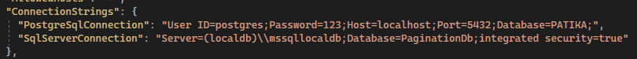

# 4-hafta-odev-emir57
Redis Cache Kullanılarak Yapılmış Pagination İşlemi (isteğe bağlı memory cache kullanılabilir)
<h5>⬇️ Kullanılan Özellikler ⬇️</h5>
File Logger⚙️ 
Async Programming ⚙️ 
Aspect Oriented Programming ⚙️ 
Validation Aspect âœ”ï¸ 
Log Aspect 📓 
Redis Cache🧰 
Memory Cache🧰 
Exception Log Aspect ⌠
Dapper and EntityFramework Repository 🧰 
<h4>⬇️ Connection Strings ⬇️</h4>

<h4> ⬇️ Redis Configuration ⬇️</h4>

