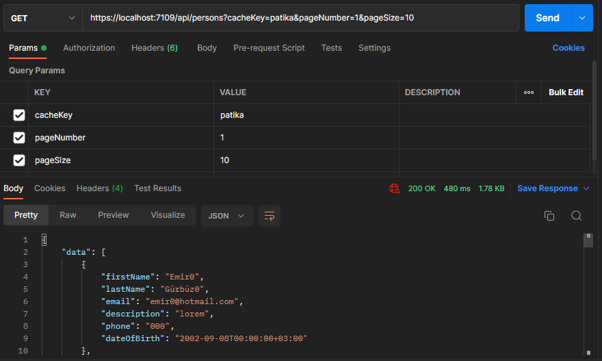

# 4-hafta-odev-emir57
File Logger⚙️ 
Async Programming ⚙️ 
Aspect Oriented Programming ⚙️ 
Validation Aspect âœ”ï¸ 
Log Aspect 📓 
Cache Aspect 🧰 
Exception Log Aspect ⌠
Dapper and EntityFramework Repository 🧰 
<h4>Connection Strings</h4>

<h4>Redis Configuration</h4>

